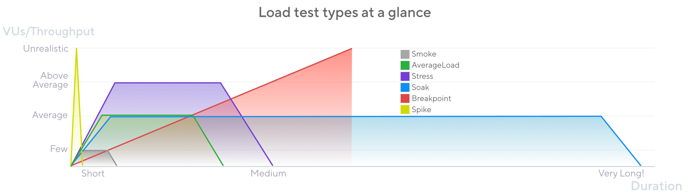

# Grafana K6 Scripts

Grafana k6 is an open-source, developer-friendly, and extensible load testing tool. k6 allows you to prevent performance issues and proactively improve reliability.

## Introduction

Many things can go wrong when a system is under load. The system must run numerous operations simultaneously and respond to different requests from a variable number of users.

### Testing Patterns

Different patterns of traffic create different risk profiles for the application. For comprehensive preparation, teams must test the system against different test types.

### Types of Performance Testing

The main types are as follows. Each type has its own article outlining its essential concepts.

- **Smoke tests** validate that your script works and that the system performs *adequately under minimal load*.

- **Average-load test** assess how your system performs *under expected normal conditions*.

- **Stress tests** assess how a system performs at its limits *when load exceeds the expected average*.

- **Soak tests** assess the reliability and performance of your system *over extended periods*.

- **Spike tests** validate the behavior and survival of your system *in cases of sudden, short, and massive increases in activity*.

- **Breakpoint tests** *gradually increase load to identify the capacity limits* of the system.

### Cheat Sheet Table

| Type         | VUs/Throughput        | Duration                   | When?                                                                                                                 |
| :----------- | :-------------------- | :------------------------- | :-------------------------------------------------------------------------------------------------------------------- |
| Smoke        | Low                   | Short (seconds or minutes) | When the relevant system or application code changes. It checks functional logic, baseline metrics, and deviations.   |
| Load         | Average production    | Mid (5-60 minutes)         | Often to check system maintains performance with average use.                                                         |
| Stress       | High (above average)  | Mid (5-60 minutes)         | When system may receive above-average loads to check how it manages.                                                  |
| Soak         | Average               | Long (hours)               | After changes to check system under prolonged continuous use.                                                         |
| Spike        | Very high             | Short (a few minutes)      | When the system prepares for seasonal events or receives frequent traffic peaks.                                      |
| Breakpoint   | Increases until break | As long as necessary       | A few times to find the upper limits of the system.                                                                   |

**Table 1**: Cheat Sheet Table
